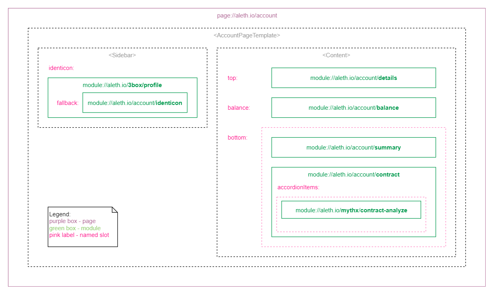
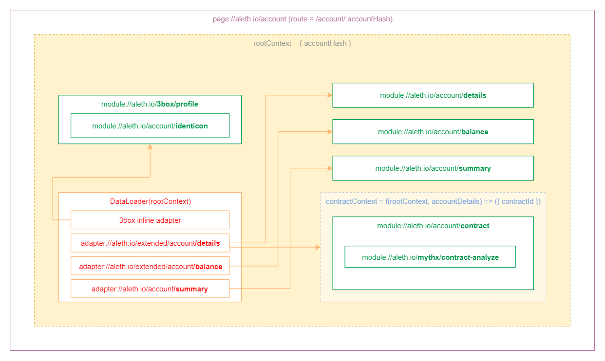
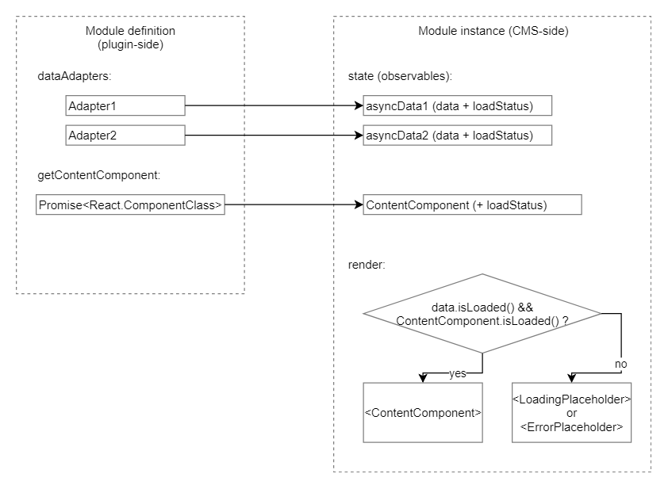

# Alethio CMS

Alethio CMS is a front-end content management system designed for real-time and frequently updating data. It features a plugin-based architecture, supporting independent content modules that can be configured and loaded at runtime.

<!-- TOC depthFrom:2 -->

- [Features](#features)
- [Concepts](#concepts)
    - [Plugins and URIs](#plugins-and-uris)
    - [Modules](#modules)
    - [Pages](#pages)
    - [Slots](#slots)
    - [Data sources](#data-sources)
    - [Data adapters](#data-adapters)
    - [Contexts](#contexts)
- [Getting started](#getting-started)
    - [Prerequisites](#prerequisites)
    - [Creating a CMS instance in a fresh app](#creating-a-cms-instance-in-a-fresh-app)
    - [Configuration](#configuration)
    - [Creating a new plugin](#creating-a-new-plugin)
- [Plugin tutorial](#plugin-tutorial)
    - [Prerequisites](#prerequisites-1)
    - [Writing a simple module](#writing-a-simple-module)
    - [Adding real data and module context](#adding-real-data-and-module-context)
    - [Reusing data adapters](#reusing-data-adapters)
    - [State transitions and optional adapters](#state-transitions-and-optional-adapters)
    - [Page critical modules](#page-critical-modules)
    - [Reacting to data changes](#reacting-to-data-changes)
    - [Reacting to MobX observable changes](#reacting-to-mobx-observable-changes)
    - [Adding plugin configuration](#adding-plugin-configuration)
    - [Configuration per module/page](#configuration-per-modulepage)
    - [Plugin localization and translation strings](#plugin-localization-and-translation-strings)
        - [Overriding plugin translations by configuration](#overriding-plugin-translations-by-configuration)
    - [Plugin runtime API](#plugin-runtime-api)
    - [TypeScript support](#typescript-support)
    - [Linking between internal pages](#linking-between-internal-pages)
    - [Creating dynamic contexts](#creating-dynamic-contexts)
    - [Data adapter dependencies](#data-adapter-dependencies)
    - [Inline modules](#inline-modules)
    - [Data Sources](#data-sources)
    - [Data dependencies between plugins](#data-dependencies-between-plugins)
    - [Inline plugins](#inline-plugins)
- [Deployment with plugins](#deployment-with-plugins)
    - [Option 1. Install the plugins in the base app at build-time](#option-1-install-the-plugins-in-the-base-app-at-build-time)
    - [Option 2. Load the plugins from an external CDN](#option-2-load-the-plugins-from-an-external-cdn)
- [Help System](#help-system)
- [CMS Development](#cms-development)

<!-- /TOC -->

## Features

- Dynamic content loading (both code / markup and data) with loading state management
- Plugins can be baked in at build-time / deployment or dynamically loaded at runtime from an external repository
- React/MobX-based rendering stack
- Customizable pages, routes and internal linking
- Supports plugins with multiple locales/languages

## Concepts

### Plugins and URIs

A plugin is a separate JavaScript bundle, that is dynamically loaded by the CMS at runtime (with JSONP). It can publicly export a collection of entities (pages, modules etc.; detailed below) usable by other plugins or by the CMS itself. The user can then reference them in the configuration file of the CMS to form complex content structures.

Each exported entity type is assigned a public URI, by which it is uniquely identified outside the plugin or even within the plugin itself. A custom URI schema is defined for each entity type:

e.g. `page://aleth.io/explorer/block` or `module://aleth.io/explorer/block/details`

As it can be seen above, each URI has a differentiating domain name and path, which is specific to each plugin publisher. It is strongly recommended to use the following guidelines when name-spacing your entities:

- the domain component should be the publisher's tld
- the path component should convey what the entity does, as simply as possible, while reducing the chance of naming collisions

This will make it a lot easier for other people to configure the CMS and understand what does what at a glance.

### Modules

A module is the basic building block of the CMS, which defines how data is rendered. At its core, the module is nothing more than a wrapper over a React component that contains HTML. It doesn't handle data fetching or domain logic, but acts more as a dumb template (data is spoon-fed into it by the CMS).

### Pages

A page definition represents content that can be seen at a specified URL / route inside the application. It contains routing information (react-router is used in the background) and an HTML template with static content into which modules can be inserted dynamically.

### Slots

A slot is a named placeholder that is placed inside a React component, in either a module or a page, allowing hierarchical (tree) structures of modules to be created dynamically at runtime. The module that contains the placeholder has no knowledge of the content that is being inserted in it, but simply renders whatever content the CMS decides to place inside that slot.

_Example:_

The following diagram shows how the above elements can be combined to form a complete page, the Alethio Explorer account page.



> Note: This hierarchy is also reflected in the React component render tree and the CMS configuration.

### Data sources

A data source is a wrapper over an external data provider (e.g. web3 or a server API). The purpose of this abstraction is to provide low-level access to data primitives, which can then be shared with other plugins.

### Data adapters

A data adapter aggregates data from one or more data sources. It sits as a middleman between the data source and the content module that displays the aggregated data. It defines how the data is loaded and when to trigger a refresh of that data.

### Contexts

Context can be thought of as an indirect means of parametrising modules, so that we could reuse them into different pages or areas of a page at runtime, without altering their original implementation. More specifically, it represents the pathing / routing information required to render a module. It is the set of query parameters that a data adapter uses to retrieve its data and thus enabling dynamic content modules to be rendered. Context can either be specified through URL route params (root context) or derived from another context, through a pure transformation function. (e.g. `context2 = f(rootContext, otherData)`)

_Example:_

The following diagram show the data flow in the Alethio Explorer account page.



> Notes:
> - Each module declares a list of data adapters (by URI) that it requires. Based on this information, the CMS internally creates a data loader which queries the data adapters and feeds the results to each module. As it can be seen, a single data loader instance is created per context as an optimization, instead of a separate instance for each module.
> - A nested context is created so we can insert modules that are tailored for contracts. This is done through a pure function that receives the parent context and data from the account details adapter as an input and produces a new context with the contractId as output.

The next diagram shows how a module is rendered based on data that it depends on.



> Notes:
> - The module definitions contains references to some data adapters, delegating the responsibility of fetching the required data, and also a react component that can be loaded asynchronously
> - The CMS will re-render and update the module content every time the data/component loading state changes

## Getting started

### Prerequisites

You will need a local installation of the CMS. You can start with your favorite React boilerplate and use the CMS component directly in your root component, as described in the next section. Or, you can have a look at the [Alethio Lite Explorer](https://github.com/Alethio/ethereum-lite-explorer) for an example setup (more specifically, [App.tsx](https://github.com/Alethio/ethereum-lite-explorer/blob/master/src/app/components/App.tsx) ).

### Creating a CMS instance in a fresh app

With an existing app already set up, you will need to render the `Cms` component into the root React component of your app:

```jsx
import React from "react";
import { Cms } from "@alethio/cms";
import { createTheme } from "@alethio/ui/lib/theme/createTheme";
import { createPalette } from "@alethio/ui/lib/theme/createPalette";

export class App extends React.Component {
    constructor(props) {
        super(props);

        this.theme = createTheme(createPalette());
    }
    render() {
        return <Cms
            // Ideally, the config should sit in a separate json file, which we load at runtime
            config={{
                // We'll load the plugins from the same base URL as the app
                "pluginsBaseUrl": "/plugins",
                "plugins": [],
                "pages": [],
                "rootModules": {
                    // Named slot that we use in our root component to insert global modules
                    "toolbar": []
                }
            }}
            theme={this.theme}
            logger={console}
            locale="en-US"
            defaultLocale="en-US"
            renderErrorPage={() => <div>404</div>}
            renderErrorPlaceholder={() => <div>An error has occurred</div>}
            renderLoadingPlaceholder={() => <div>Loading...</div>}
        >{ ({ slots, routes }) => {
            return <div>
                { /* Route-independent content */ }
                <div>{slots && slots["toolbar"]}</div>
                { /* Route-dependent content */ }
                <div>{ routes }</div>
            </div>;
        }}</Cms>;
    }
}
```

See [Cms.tsx](./src/component/Cms.tsx) for props documentation.

### Configuration

Dynamic runtime configuration can be passed to the `Cms` instance via the `config` prop. We recommend placing this configuration in a separate `config.json` file, loaded from the app's base URL at runtime. This allows decoupling the configuration from the packaged source code and avoid a rebuild whenever the config is changed. In the future, we intent to provide a GUI-based configuration editor that avoids editing the raw JSON config altogether.

For full reference on the structure of the config object, please see [IConfigData](./src/IConfigData.ts).

For examples, see the [plugin tutorial](#plugin-tutorial).

### Creating a new plugin

You can start by creating the plugin boilerplate with the CMS plugin tool:

`$ npm i -g @alethio/cms-plugin-tool@^1.0.0-beta.4`

Create a new empty folder where the plugin sources will be generated (this can be a git repo checkout):

`$ mkdir <pluginName> && cd <pluginName>`

**IMPORTANT**: You must be in the plugin folder to run the next command.

`$ acp init <publisher> <pluginName> [npm_package_name]`

Or, if you prefer JavaScript instead of TypeScript:

`$ acp init --js <publisher> <pluginName> [npm_package_name]`

- `<publisher>` is a namespace specific to the publisher of the plugin. We recommend setting this to your org's domain name, if you have one, or your github user handle, otherwise.
- `<pluginName>`, together with the `<publisher>`, is the name under which the CMS will reference the plugin. The CMS forms an unique plugin URI, like `plugin://<publisher>/<pluginName>`.
- `[npm_package_name]` is the name that will be used in the generated `package.json` (used if the plugin will be published to npm).

Next, install the plugin dependencies and build the distributables with:

`$ npm install`

`$ npm run watch` for development or `$ npm run build` for minified/production build.

Switch back to your main app folder and link the plugin for development:

`$ acp link <plugin_repo_folder>`

This command will symlink the plugin distributable to the `dist/plugins` folder for development. You can customize this folder with the `--target` option. Call `acp` with no arguments for detailed usage.

Finally, edit the CMS config object to enable the plugin (or the config.dev.jsonc file if using the lite explorer setup):
```jsonc
{
    // ...
    "plugins": [{
        "uri": "plugin://<publisher>/<pluginName>"
    }]
    // ...
}
```

## Plugin tutorial

### Prerequisites

This section assumes that you already have a host app set up with a properly configured CMS instance and you have a freshly generated plugin boilerplate. If you haven't done so, please refer to the previous sections.

*NOTE 1*: We used `$ acp init --js my.company.tld my-plugin @company/my-plugin` for our examples.

*NOTE 2*: For the sake of keeping things short and simple, all our examples are written in plain JavaScript (ES2015+). However, we do recommend switching to TypeScript later, for production. This will help catching errors and malformed plugin entities at compile-time and avoid cryptic runtime errors. See the [TypeScript support](#typescript-support) section on how to properly type plugins.

### Writing a simple module

We'll start with an example, which we'll use throughout the tutorial. Suppose we want to create a component that shows information about a user's profile. We'll create a new page with a single module that shows just the user's name.

Let's create a new module definition. For testing, we can add this directly in our plugin's entry file (make sure it has a proper jsx/tsx file extension), but later we will want to create a separate file for it and use an import instead.

```jsx
import React from "react";

// in plugin's init method:

api.addModuleDef("module://my.company.tld/my-plugin/profile", {
    // We don't use context for now, so it's an empty object
    contextType: {},
    // We don't use data adapters yet, we'll pass an empty array
    dataAdapters: [],
    // The React component is loaded asynchronously and then cached by the CMS until a full page reload
    // It can either be a component class or a functional component
    getContentComponent: async () => (props) => <div>Hello, {props.name}!</div>,
    // We receive some props from the cms and we map them to the props that our component needs
    getContentProps: cmsProps => ({ name: "Joe" })
});
```

Right now, our module is not visible anywhere so let's also create a simple page for it:
```jsx
// in plugin's init method:

api.addPageDef("page://my.company.tld/my-plugin/profile-page", {
    contextType: {},
    paths: {
        // We'll map the page to an application path. The left-hand side is a react-router path expression.
        // The right hand side receives params extracted from the path expression and
        // resolves to an empty context object, which we won't use for now
        "/profile": params => ({})
    },
    // Function that resolves to a React component class/ functional component. It can also be async.
    getPageTemplate: () => ({ slots }) => <div>
        <h1>User profile</h1>
        { /* We'll define a single named slot ("content"), where the CMS will inject our module */ }
        { slots && slots.content }
    </div>
});
```

Finally, let's tie the pieces together by editing the configuration again:
```jsonc
{
    // ...
    "pages": [{
        "def": "page://my.company.tld/my-plugin/profile-page",
        "children": {
            "content": [
                { "def": "module://my.company.tld/my-plugin/profile" }
            ]
        }
    }]
    // ...
}
```

If we navigate to the `/profile` path in our app, we should see everything correctly rendered. In the developer console you should see:
```
Loading plugin plugin://my.company.tld/my-plugin...
Plugins loaded.
```

### Adding real data and module context

We currently have a module that shows dummy data. We'd like to be able to fetch that data from an external service. Let's assume our service fetches a user profile based on a user ID. This ID will effectively become the [context](#contexts) of the profile page. We'll start by creating a data adapter for the profile data and then see how we can pass the context information through the page and to our module.

```jsx
// ...

// in plugin's init method
api.addModuleDef("module://my.company.tld/my-plugin/profile", {
    // We declare that our module needs to be inserted into a context that has a userId
    contextType: {
        userId: "number"
    },
    // We can define data adapters inline, or reference global ones by their URI
    // For this example we'll just define the adapter inline
    dataAdapters: [{
        // The alias is required so we can reference the result later in getContentProps.
        alias: "profile",
        // This is the actual adapter definition
        def: {
            contextType: {
                userId: "number"
            },
            async load(context, cancelToken) {
                // This can be an XHR
                return Promise.resolve({ name: "Joe", id: context.userId });
            }
        }
    }],
    // Here we define our React component inline. As best practice, we should move it to a separate file and
    // use a dynamic import to extract it into a separate bundle. Otherwise, we'll slow down the initial
    // page load while the CMS loads our plugin
    getContentComponent: async () => (props) => <div>
        Hello, {props.name}! Your user ID is {props.id}.
    </div>,
    getContentProps: ({ context, asyncData }) => ({
        id: context.userId,
        // AsyncData is a wrapper over a data adapter result that also contains loading state info.
        // We get access to the wrapped data through the `data` property
        name: asyncData.get("profile").data.name
    })
});
```

Now that we have our updated module, we need to make the context information available to it, otherwise it will no longer work since we require a userId to exist. We'll modify the profile page definition to accept a userId parameter in its URL and create a root context with it.

```jsx
api.addPageDef("page://my.company.tld/my-plugin/profile-page", {
    contextType: {
        userId: "number"
    },
    paths: {
        // The left hand side is a react-router url matcher, which resolves on the right hand side to a context object or we could even use a context definition object to create a dynamic context
        "/profile/:userId": params => ({ userId: Number(params.userId) }),
        // We'll also allow redirects from profile_%d to profile/%d
        "/profile_:userId": params => `/profile/${params.userId}`
    },
    // ...
});
```

Now, if we go to `/profile/1`, we should see the data from the API displayed in our module.

### Reusing data adapters

What if we have more than one module that depends on the same data? Inlining our data adapter is simple enough, but that prevents us from reusing it in another module or plugin. Let's create a public data adapter which we can then reference in our module.

```js
// in plugin's init method:
api.addDataAdapter("adapter://my.company.tld/my-plugin/profile", {
    contextType: {
        userId: "number"
    },
    async load(context, cancelToken) {
        // This can be an XHR
        return Promise.resolve({ name: "Joe", id: context.userId });
    }
});

api.addModuleDef("module://my.company.tld/my-plugin/profile", {
    contextType: {
        userId: "number"
    },
    dataAdapters: [{
        ref: "adapter://my.company.tld/my-plugin/profile"
    }],
    getContentComponent: async () => (props) => <div>
        Hello, {props.name}! Your user ID is {props.id}.
    </div>,
    getContentProps: ({ context, asyncData }) => ({
        id: context.userId,
        name: asyncData.get("adapter://my.company.tld/my-plugin/profile").data.name
    })
});
```

### State transitions and optional adapters

The CMS handles data loading in the background and makes the result directly available in our component. However, what happens while the module is being loaded or if some error occurred?

By default, any data adapter that we specify in our module definition must return a value before our module is rendered. That means that `asyncData.get("<adapter-uri-or-alias>").data` will always contain the adapter result.
If we want to render something while loading the data or handle data errors in a special way, we can define custom elements for these cases:

```jsx
import { ErrorBox } from "@alethio/ui/lib/ErrorBox";
import { LoadingBox } from "@alethio/ui/lib/LoadingBox";

// in plugin's init method:

api.addModuleDef("module://my.company.tld/my-plugin/profile", {
    // ...
    getErrorPlaceholder: ({ translation }) =>
        <ErrorBox>An error has occurred</ErrorBox>,
    getLoadingPlaceholder: ({ translation }) =>
        <LoadingBox>Loading...</LoadingBox>
});
```

> Important notes:
> - Error and loading placeholders also come into effect when loading the module's main content component (e.g. if it's loaded with a dynamic import)
> - If a module throws an error, the error placeholder is rendered, if it exists. Otherwise nothing is rendered at all. There is no sensible default for the placeholder.

If we have an adapter that is slow to load, but we can already partially render the module, we can mark that adapter as optional and then manually handle the state changes in our adapter result:

```jsx
import { observer } from "mobx-react";
import { LoadStatus } from "plugin-api/LoadStatus";

api.addModuleDef("module://my.company.tld/my-plugin/profile", {
    contextType: {
        userId: "number"
    },
    dataAdapters: [{
        ref: "adapter://my.company.tld/my-plugin/profile",
        optional: true
    }],
    // Important: use MobX observer to react to state changes
    getContentComponent: async () => observer(({ asyncProfile }) => <div>
        { asyncProfile.loadStatus === LoadStatus.Loading ?
        "Loading..." :
        asyncProfile.loadStatus === LoadStatus.Error ?
        "An error has occured" :
        `Hello, ${asyncProfile.data.name}!`
        }
    </div>),
    getContentProps: ({ asyncData }) => ({
        asyncProfile: asyncData.get("adapter://my.company.tld/my-plugin/profile")
    })
});
```

### Page critical modules

It is common to have a "main" content module on the page, or even more than one. If that module hasn't loaded yet, we might not want to render the rest of the page at all and wait until everything has stabilized by showing a page-wide spinner. To achieve this, we'll define loading and error placeholders in the page itself, while marking our module with `pageCritical` in the configuration.

Important: `pageCritical` modules can only be defined in the root context of each page

```jsonc
{
    // ...
    "pages": [{
        "def": "page://my.company.tld/my-plugin/profile-page",
        "children": {
            "content": [
                { "def": "module://my.company.tld/my-plugin/profile", "pageCritical": true }
            ]
        }
    }]
}
```

### Reacting to data changes

We can react to data changes by triggering events in our data loaders when we detect a change. For this purpose a special kind of object called a data watcher is created. This object must define an `onData` event, `watch` and `unwatch` methods. After every data loader successful `load()`, a new watcher is created and `watch()` is called. Any previous watcher is destroyed by calling `unwatch()`. Whenever an `onData` event is triggered, the data loader does a reload on that adapter.

```jsx
import { EventDispatcher } from "@puzzl/core/lib/event/EventDispatcher";

class CustomDataWatcher {
    constructor(interval) {
        this.interval = interval;
        this.onData = new EventDispatcher();
    }

    watch() {
        // Just for an auto-refresh every 5 seconds
        this.timeoutId = setTimeout(() => this.onData.dispatch(), this.interval);
    }

    unwatch() {
        clearTimeout(this.timeoutId);
    }
}

api.addDataAdapter("adapter://my.company.tld/my-plugin/profile", {
    contextType: {
        userId: "number"
    },
    async load(context, cancelToken) {
        return Promise.resolve({ name: `Joe (@${Date.now()})`, id: context.userId });
    },
    createWatcher(context, lastDataResult) {
        return new CustomDataWatcher(5000);
    }
});
```

### Reacting to MobX observable changes

For this purpose we can use a predefined watcher, which is available through the runtime `plugin-api` module.
```jsx
import { observable } from "mobx";
import { ObservableWatcher } from "plugin-api/watcher/ObservableWatcher";

const myStore = observable({
    myObservable: 2
});

// in plugin's init method

api.addDataAdapter("adapter://my.company.tld/my-plugin/profile", {
    contextType: {
        userId: "number"
    },
    async load(context, cancelToken) {
        return Promise.resolve({ name: `Joe (@${Date.now()})`, id: context.userId });
    },
    createWatcher(context, lastDataResult) {
        return new ObservableWatcher(() => myStore.myObservable);
    }
});

setInterval(() => { myStore.myObservable++; }, 3000);
```

### Adding plugin configuration

Let's take our profile example. We might want for instance to pass the API endpoint URL by configuration, instead of
hardcoding it in the plugin. We'll modify the CMS config as follows:

```json
{
    "plugins": [{
        "uri": "plugin://my.company.tld/my-plugin",
        "config": {
            "profileApiUrl": "https://api.my.company.tld/profile/%d"
        }
    }]
}
```

Then, we can update our data adapter to use that URL from the config:

```jsx
import { HttpRequest } from "@puzzl/browser/lib/network/HttpRequest";

// in plugin's init method:
api.addDataAdapter("adapter://my.company.tld/my-plugin/profile", {
    contextType: {
        userId: "number"
    },
    async load(context, cancelToken) {
        return await new HttpRequest().fetchJson(config.profileApiUrl.replace("%d", context.userId));
    }
});
```

### Configuration per module/page

Global plugin configuration is useful when shared by multiple entities, but in other cases we might just want to pass some simple options to a single module or page, without changing its implementation. We can do this by providing an `options` key together with the entity URI, in the CMS `pages` config.

```json
{
    "pages": [{
        "def": "page://my.company.tld/my-plugin/profile-page",
        "children": {
            "content": [
                {
                    "def": "module://my.company.tld/my-plugin/profile",
                    "options": {
                        "showTime": true
                    },
                    "pageCritical": true
                }
            ]
        }
    }]
}
```

```jsx
// in plugin's init method
api.addModuleDef("module://my.company.tld/my-plugin/profile", {
    contextType: {},
    dataAdapters: [],
    getContentComponent: async () => ({ name, showTime }) => <div>Hello, {name}! { showTime ? `Time is ${Date.now()}` : null }</div>,
    getContentProps: ({ options }) => ({ name: "Joe", showTime: options && options.showTime })
});
```

### Plugin localization and translation strings

The locale string that is passed to the `Cms` component will propagate to every plugin and can be accessed inside each module's content component. Plugins can define translation strings per language, which are loaded by the CMS and accessible via a translation service.

The plugin will need to be modified like this:
```jsx
const myPlugin = {
    //...
    getAvailableLocales() {
        return ["en-US", "zh-CN"];
    },

    async loadTranslations(locale: string) {
        return await import("./translation/" + locale + ".json");
    }
}
```

An example translation file might look like this:
```json
{
    "general.loading": "Loading",
    "profile.header": "Hello, {name}!"
}
```

Translation strings can be accessed from the `translation` prop, which is available in module's react components (main content, loading and error placeholders):
```jsx
api.addModuleDef("module://my.company.tld/my-plugin/profile", {
    contextType: {
        userId: "number"
    },
    dataAdapters: [{
        ref: "adapter://my.company.tld/my-plugin/profile"
    }],
    getContentComponent: async () => (props) => <div>
        { props.translation.get("profile.header", { "{name}": props.name }) }
    </div>,
    getLoadingPlaceholder: ({ translation }) => <div>{ translation.get("general.loading") }</div>,
    getContentProps: ({ context, asyncData, translation, locale }) => ({
        translation,
        name: asyncData.get("adapter://my.company.tld/my-plugin/profile").data.name
    })
});
```

#### Overriding plugin translations by configuration

There are some cases where we would like to override some translation strings from configuration, without rebuilding a plugin. We can easily do this by adding a `translations` key in the `plugins` section of the CMS config:

```jsonc
{
    "plugins": [{
        "uri": "plugin://my.company.tld/my-plugin?v=1.0.0",
        "config": {
            // ...
        },
        "translations": {
            "en-US": {
                "someKey": "My custom translation string"
            }
        }
    }]
}
```

### Plugin runtime API

Each plugin has access to a runtime public API. The CMS exposes various functions and classes under the `plugin-api` package. This is not a real npm package, but a faux package, created at runtime. The plugin can get access to it by doing `require("plugin-api")`. If using webpack, make sure to mark everything starting with `plugin-api` as an external, to allow the CMS to resolve it instead at runtime. Besides this API, the CMS also exposes the `react`, `react-dom`, `mobx`, `mobx-react` and `styled-components` packages, to save the hassle of including separate copies in each plugin. For a comprehensive list of exported items, please see the [plugin-api](https://github.com/Alethio/cms-plugin-api) TypeScript definitions.

### TypeScript support

The CMS is a TypeScript first-class citizen. The [plugin-api](https://github.com/Alethio/cms-plugin-api) npm package exports TypeScript definitions for the corresponding runtime as well as interfaces for defining plugins, modules, pages, contexts, adapters etc.

```tsx
import React from "react";
import { IPlugin, IModuleDef, ITranslation } from "plugin-api";

interface IProfileProps {
    translation: ITranslation;
    name: string;
}
interface IUserContext {
    userId: number;
}
interface IProfileData {
    name: string;
}
const profileModule: IModuleDef<IProfileProps, IUserContext> = {
    contextType: {
        userId: "number"
    },
    dataAdapters: [{
        ref: "adapter://my.company.tld/my-plugin/profile"
    }],
    getContentComponent: async () => (props) => <div>
        { props.translation.get("profile.header", { name: props.name }) }
    </div>,
    getLoadingPlaceholder: ({ translation }) => <div>{ translation.get("general.loading") }</div>,
    getContentProps: ({ context, asyncData, translation, locale }) => ({
        translation,
        name: (asyncData.get("adapter://my.company.tld/my-plugin/profile")!.data as IProfileData).name
    })
};

const myPlugin: IPlugin = {
    init(config, api, logger, publicPath) {
        // ...
        api.addModuleDef("module://my.company.tld/my-plugin/profile", profileModule);
    }
}

// tslint:disable-next-line:no-default-export
export default myPlugin;
```

### Linking between internal pages

Due to the dynamic nature of the pages and the mapped routes, linking is done with a special `Link` component that uses page URIs instead of real URLs. This component also disables a link if the target page is not present in the configuration.

Example:
```jsx
import { Link } from "plugin-api/component/Link";

const myModule = {
    // ...
    getContentComponent: async () => () => <div>
        { /* Notice the query string which is a serialized version of the context object of that page */ }
        { /* If the page URI cannot be resolved, the link is deactivated */ }
        <Link to={`page://my.company.tld/my-plugin/profile-page?userId=1234`}>
            This is a link
        </Link>
    </div>
};
```

Important: for links to work, we also need to define a way of transforming the page URI back into a full URL. Because of this we need to add one more method to our page object:

```jsx
api.addPageDef("page://my.company.tld/my-plugin/profile-page", {
    // ...
    buildCanonicalUrl: ({ userId }) => `/profile/${userId}`,
    // ...
});
```

We can also access the linking logic directly with the `withInternalNav` higher-order component:

```jsx
import { withInternalNav } from "plugin-api/withInternalNav";

class MyComponent extends React.Component {
    render() {
        return <button onClick={() => this.handleClick()}>A Link</button>
    }

    handleClick() {
        // Try to redirect to target page if it exist
        if (this.props.internalNav.goTo("page://my.company.tld/my-plugin/non-existent")) {
            // doesn't get here because we used a non-existent page URI
        } else {
            console.log("Target page doesn't exist");

            let resolvedUrl = this.props.internalNav.resolve("page://my.company.tld/my-plugin/profile-page?userId=1");
            if (resolvedUrl) {
                location.href = resolvedUrl;
            }
        }
    }
}

const MyComponentWithNav = withInternalNav(MyComponent);
```

### Creating dynamic contexts

In our profile example page we might want to add a module that shows information about an external service associated with our user. Our profile API returns an `userId` and could also return a `serviceId`, which we can use to query an external app for additional info. Our new module doesn't really care about the `userId` and, ideally, it should only depend on the `serviceId`. This also allows us to put the module anywhere we have access to the `serviceId` without tightly coupling it with the profile page. Given that now the module context is different from the page context, how we can go about adding the module in the profile page? With a new context definition:

```jsx
api.addContextDef("context://my.company.tld/my-plugin/service-context", {
    parentContextType: {
        userId: "number"
    },
    contextType: {
        serviceId: "string"
    },
    dataAdapters: [{
        ref: "adapter://my.company.tld/my-plugin/profile"
    }],
    create(parentContext, parentData) {
        let serviceId = parentData.get("adapter://my.company.tld/my-plugin/profile").data.serviceId;
        return { serviceId };
    }
});

api.addDataAdapter("adapter://my.company.tld/my-plugin/profile", {
    contextType: {
        userId: "number"
    },
    async load(context, cancelToken) {
        return Promise.resolve({ name: "Joe", serviceId: 15 })
    }
});

api.addModuleDef("module://my.company.tld/my-plugin/service-details", {
    contextType: {
        serviceId: "number"
    },
    dataAdapters: [],
    getContentComponent: async () => ({serviceId}) => <div>
        Service ID: {serviceId}
    </div>,
    getContentProps: ({ context }) => ({ serviceId: context.serviceId })
});
```

We'll then update the config as follows:
```jsonc
{
    "pages": [{
        "def": "page://my.company.tld/my-plugin/profile-page",
        "children": {
            "content": [
                { "def": "module://my.company.tld/my-plugin/profile" },
                {
                    "def": "context://my.company.tld/my-plugin/service-context",
                    "children": [
                        { "def": "module://my.company.tld/my-plugin/service-details" }
                    ]
                }
            ]
        }
    }]
}
```

Refresh the browser page and you should see everything rendered correctly.

### Data adapter dependencies

In some case dynamic context could be an unnecessary overhead, which can simply be solved by directly coupling several data adapters together. Building on the example given in the previous section, we could have an adapter `service-details` that returns data for a service, based on the `serviceId`. Instead of creating a `{ userId, serviceId }` context, we could simply get the profile data (that contains the `serviceId`) by making the `profile` adapter a dependency of the `service-details` adapter.

```jsx
api.addDataAdapter("adapter://my.company.tld/my-plugin/profile", {
    contextType: {
        userId: "number"
    },
    async load(context, cancelToken) {
        return Promise.resolve({ name: "Joe", serviceId: 15 })
    }
});

api.addDataAdapter("adapter://my.company.tld/my-plugin/service-details", {
    contextType: {
        userId: "number"
    },
    dependencies: [
        "adapter://my.company.tld/my-plugin/profile"
    ],
    async load(context, cancelToken, depData) {
        let { serviceId } = depData.get("adapter://my.company.tld/my-plugin/profile");

        return Promise.resolve({ serviceId, someRemotelyFetchedData: {} });
    }
});
```

### Inline modules

Sometimes, we might want to take advantage of the CMS module rendering, without having to actually define one with a public URI and adding a separate entry in the CMS config. In this case, we can use the `plugin-api/component/InlineModule` component.

```jsx
import { InlineModule } from "plugin-api/component/InlineModule";

const inlineModuleDef = {
    dataAdapters: [{
        alias: "someAdapter",
        def: {
            contextType: {
                someData: "number"
            },
            load: async ctx => ctx.someData
        }
    }],
    getContentComponent: async () => ({ someData })  => <div>Some data: {someData}</div>,
    getContentProps: ({ asyncData }) => ({
        someData: asyncData.get("someAdapter").data
    })
};

class SomeComponent extends React.Component {
    render() {
        return <InlineModule
            moduleDef={inlineModuleDef}
            context={{
                someData: 2
            }}
            logger={console}
            extraContentProps={{
                translation: this.props.translation
            }}
        />;
    }
}

api.addModuleDef("module://my.company.tld/my-plugin/profile", {
    // ...
    getContentComponent: async () => (props) => <div>
        { /* ... */ }
        <SomeComponent translation={props.translation} />
    </div>,
    // ...
});
```

> Notes:
> - This also allows us to create a context from our UI data, which is not otherwise available outside the rendering layer.
> - Inline modules can only use inline data adapters

### Data Sources

We might want to share the data fetching primitives between adapters or even with external plugins. For this purpose we can define a data source. The only requirement for a data source is that it must be an object with an `async init()` method. In this method we can do things such as opening an initial socket connection, or logging into an external API. The CMS will call this method after all plugins have been loaded, before bootstrapping the app. Please note the blocking nature of this call. The CMS will not continue until all data sources were successfully initialized.

```jsx
const myPlugin = {
    init(config, api, logger, publicUrl) {
        // This method is synchronous and we're only allowed to declare entities. If we want to do side-effects,
        // such as external API calls, establishing connections etc, those should be done in the data source init()

        let dataSource = {
            async init() {
                // do stuff
            },
            fetchSomeData() {
                return {
                    a: 2
                };
            }
        };
        api.addDataSource("source://my.company.tld/my-plugin/my-data-source", dataSource);

        // an adapter that uses the above data source
        api.addDataAdapter("adapter://my.company.tld/my-plugin/my-adapter", {
            contextType: {},
            load: async () => Promise.resolve(dataSource.fetchSomeData())
        });
    }
}
```

(TODO) Make data sources accessible between plugins using their URIs.

### Data dependencies between plugins

There are cases when plugins depend on each other's data for initialization. Simple data adapter dependencies are supported when initializing a plugin's data source, like so:

```jsx
// in plugin1
api.addDataAdapter("adapter://my.company.tld/plugin1/some-data", { /*...*/ load: async () => 2 });
// in plugin2
api.addDataSource("source://my.company.tld/plugin-2/some-source", {
    dependencies: [{
        ref: "adapter://my.company.tld/plugin1/some-data",
        alias: "someData"
    }],
    init: async (depData) => {
        console.log(depData.get("someData"));
        // Or depData.get("adapter://my.company.tld/plugin1/some-data")
    });
});
```

**Important**: Only a subset of data adapter features are supported. For instance, it must not have nested dependencies or a contextType other than `{}` (root context).

### Inline plugins

In some cases, we might want to make simple additions or overrides to existing plugins, or just prototype without going through the overhead of creating a new plugin repo + boilerplate, installing and deploying it.

We'll first create a new baked-in plugin, by adding a file `myPlugin.js` (or `myPlugin.ts` is using TypeScript) in our host app. We'll assume this to be in the same folder as our `App` component:

The structure for inline plugins is similar to regular ones, except that init method no longer receives a `publicPath` parameter. See [IInlinePlugin](src/IInlinePlugin.ts) for reference.

```jsx
export const myPlugin = {
    init(config, api, logger) {
        // ... regular plugin stuff ...
    },
    getAvailableLocales: () => ["en-US", "zh-CN"],
    // We assume we can use the same translations as the host app
    loadTranslations: (locale) => import("../translation/" + locale + ".json")
};
```

**IMPORTANT**: We also need to add the following to our webpack config `externals` section:
```js
externals: [
    function(context, request, callback) {
        if (/^plugin-api\/.+$/.test(request)) {
            return callback(null, 'commonjs ' + request);
        }
        callback();
    }
]
```

Now let's pass the plugin to the `Cms` component instance in our `App` component:

```jsx
//...

class App /*...*/{
    //...
    render() {
        return <Cms
            //...
            inlinePlugins={{
                "inline-plugin://my.company.tld/my-plugin": () => import("./myPlugin").then(({ myPlugin }) => myPlugin)
            }}
        >
            {/*...*/}
        </Cms>
    }
}
```

*Note*: Inline plugins use a different `inline-plugin://` scheme, to differentiate them from externally loaded plugins.

Lastly, we need to add our plugin to the CMS config object:

```jsonc
{
    //...
    "plugins": [{
        //...
        "uri": "inline-plugin://my.company.tld/my-plugin"
        //...
    }]
    //...
}
```

## Deployment with plugins

### Option 1. Install the plugins in the base app at build-time

Assuming our app has a `dist` folder for the built assets, we can install the plugins inside this folder, then package and deploy the entire folder.

The following changes will be needed:
1. In the CMS config we'll specify `"pluginsBaseUrl": "/plugins"`.
2. In the app repo we'll execute `$ acp install <plugin_npm_package_name_or_local_folder>`. See `@alethio/cms-plugin-tool` for usage.

This will copy the built plugins inside `dist/plugins` folder.

3. Lastly, we need to update the plugin URIs in the config to also include the plugin version string. This version string can be found in the plugin manifest (package.json). In production mode, each plugin version is installed inside a separate subfolder (per version). In contrast, when we linked the plugins for development, a single folder was generated and the version string was not required.

```jsonc
{
    "plugins": [{
        "uri": "plugin://my.company.tld/my-plugin?v=1.0.0"
    }]
}
```

### Option 2. Load the plugins from an external CDN

This is achieved by copying the built plugin files to an external CDN and changing `pluginsBaseUrl` config to point to that CDN. This means the base app can be deployed independently from the plugins. Whenever we publish a new version of the plugin we only need to update the version string in the config.

We can first install the plugins in a temporary folder:
`$ acp install --target /tmp/plugins <plugin_npm_package_or_local_folder>`

And then sync the target folder structure with the external CDN via preferred method.

## Help System

Help content can be defined per module by adding a `getHelpComponent` method in the module definition.

Example:
```jsx
let module = {
    //...
    getHelpComponent: () => ({ translation, /* ... */ }) => translation.get("my.help.content.key")
}
```

Help can be displayed by turning on/off a special "help mode". In help mode, the user can hover a module and if that module has help, it will be highlighted with a border and "help" mouse cursor. When clicked, the help content for that module is rendered with a user-defined component. Help mode can be controlled from the callback which is passed to `Cms` component as child.

Example:
```jsx
import React from "react";
import ReactDOM from "react-dom";
import { Observer } from "mobx-react";
import { Cms } from "@alethio/cms";
import { Layer } from "@alethio/ui/lib/overlay/Layer";
import { Mask } from "@alethio/ui/lib/overlay/Mask";
import { HelpIcon } from "@alethio/ui/lib/icon/HelpIcon";
import { Toolbar } from "@alethio/ui/lib/layout/toolbar/Toolbar";
import { ToolbarItem } from "@alethio/ui/lib/layout/toolbar/ToolbarItem";
import { ToolbarIconButton } from "@alethio/ui/lib/layout/toolbar/ToolbarIconButton";
import { Button } from "@alethio/ui/lib/control/Button";

export class App extends React.Component {
    // ...
    render() {
        return <Cms
            // ...
            HelpComponent={({ children, module, onRequestClose }) => ReactDOM.createPortal(<>
                <Mask />
                <Layer>
                    {children}
                    <Button onClick={onRequestClose}>Got it</Button>
                </Layer>
            </>, document.body)}
        >{ ({ slots, routes, helpMode }) => {
            return <div>
                <Toolbar>
                    { /* Observer prevents the whole page from reacting whenever helpMode is toggled */}
                    <Observer>{() =>
                        <ToolbarItem title={helpMode.isActive() ? "Toggle off help mode" : "Toggle on help mode"}>
                            <ToolbarIconButton
                                active={helpMode.isActive()}
                                Icon={HelpIcon}
                                onClick={() => helpMode.toggle()} />
                        </ToolbarItem>
                    }</Observer>
                    {slots && slots["toolbar"]}
                </Toolbar>
                { /* ... */ }
                <div>{ routes }</div>
            </div>;
        }}</Cms>;
    }
}
```

## CMS Development

1. Clone the repo
2. `npm install`
3. `npm run build-dev` or `npm run watch`.
4. Link the library in your app with npm link or npm install with local path.
